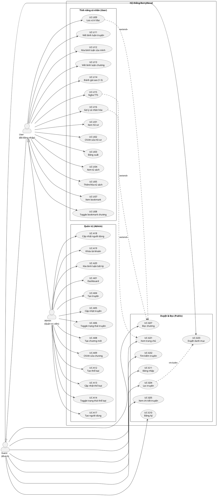

# Use Case Tổng Quan – BerryNovel

Tài liệu này hướng dẫn bạn vẽ lại **sơ đồ Use Case tổng quan** cho hệ thống đọc truyện BerryNovel, gồm 3 tác nhân chính: **Guest (Khách)**, **User (Người dùng đã đăng nhập)** và **Admin (Quản trị viên)**.

---

## 1. Mô tả hệ thống

BerryNovel là một ứng dụng web đọc truyện chữ (webnovel) xây dựng bằng Spring Boot MVC + Thymeleaf. Hệ thống có hai khu vực chính:

- **Client (`/`)** – Phần người dùng: trang chủ, đọc truyện, thư viện, hồ sơ.
- **Admin (`/admin`)** – Phần quản trị: quản lý truyện, chương, thể loại, người dùng.

---

## 2. Các tác nhân (Actors)

| Tác nhân | Mô tả |
|----------|-------|
| **Guest** | Người chưa đăng nhập. Có thể duyệt và đọc nội dung công khai. |
| **User** | Người đã đăng ký và đăng nhập. Có đầy đủ chức năng cá nhân. |
| **Admin** | Tài khoản có vai trò `ROLE_ADMIN`. Có quyền truy cập `/admin/**`. |

> **Kế thừa:** User **kế thừa** toàn bộ quyền của Guest.  
> Admin **kế thừa** toàn bộ quyền của User.

---

## 3. Danh sách Use Case theo tác nhân

### 3.1 Guest (Khách)

> Các use case không yêu cầu xác thực (Security: `permitAll`).

| Mã UC | Tên Use Case | Route |
|-------|-------------|-------|
| UC-G01 | Xem trang chủ | `GET /home` hoặc `GET /` |
| UC-G02 | Tìm kiếm truyện | `GET /search?keyword=...` |
| UC-G03 | Duyệt danh mục truyện | `GET /category` |
| UC-G04 | Lọc truyện theo thể loại / loại / trạng thái | `GET /category?genres=&types=&progresses=` |
| UC-G05 | Xem chi tiết truyện | `GET /{novelSlug}` |
| UC-G06 | Xem danh sách chương của truyện | (nằm trong trang chi tiết truyện) |
| UC-G07 | Đọc chương truyện | `GET /{novelSlug}/{chapterSlug}` |
| UC-G08 | Xem bình luận truyện | (nằm trong trang chi tiết truyện) |
| UC-G09 | Xem bình luận chương | (nằm trong trang đọc chương) |
| UC-G10 | Đăng ký tài khoản | `GET /register`, `POST /register` |
| UC-G11 | Đăng nhập | `GET /login`, `POST /login` |

---

### 3.2 User (Người dùng đã đăng nhập)

> Các use case yêu cầu `authentication != null && isAuthenticated`.

#### Tài khoản & Hồ sơ

| Mã UC | Tên Use Case | Route |
|-------|-------------|-------|
| UC-U01 | Xem hồ sơ cá nhân | `GET /profile` |
| UC-U02 | Chỉnh sửa thông tin cá nhân | `GET /profile/edit`, `POST /profile/edit` |
| UC-U03 | Đăng xuất | `POST /logout` |

#### Thư viện (Bookshelf)

| Mã UC | Tên Use Case | Route |
|-------|-------------|-------|
| UC-U04 | Xem tủ sách (bookshelf) | `GET /bookshelf` hoặc `GET /library` |
| UC-U05 | Thêm / Xóa truyện khỏi tủ sách | `POST /bookshelf/toggle/{novelId}` |
| UC-U06 | Xóa nhiều truyện khỏi tủ sách | `POST /bookshelf/delete` |
| UC-U07 | Xem danh sách bookmark | `GET /bookshelf/bookmark` |

#### Bookmark vị trí đọc

| Mã UC | Tên Use Case | Route |
|-------|-------------|-------|
| UC-U08 | Bật / Tắt bookmark chương | `POST /bookshelf/bookmark/toggle/{novelId}/{chapterId}` |
| UC-U09 | Lưu vị trí đọc (dòng / đoạn) | `POST /bookshelf/bookmark/upsert/{novelId}/{chapterId}` |
| UC-U10 | Xóa bookmark chương | `POST /bookshelf/bookmark/delete/{novelId}/{chapterId}` |

#### Bình luận

| Mã UC | Tên Use Case | Route |
|-------|-------------|-------|
| UC-U11 | Viết bình luận truyện | `POST /{novelSlug}/comment` |
| UC-U12 | Xóa bình luận của mình | `POST /{novelSlug}/comment/{commentId}/delete` |
| UC-U13 | Viết bình luận chương | `POST /{novelSlug}/{chapterSlug}/comments` |

#### Đánh giá

| Mã UC | Tên Use Case | Route |
|-------|-------------|-------|
| UC-U14 | Đánh giá sao truyện (1–5) | `POST /novel/{novelId}/rate` |

#### Tính năng đọc nâng cao (Frontend)

| Mã UC | Tên Use Case | Ghi chú |
|-------|-------------|---------|
| UC-U15 | Nghe TTS (Text-to-Speech) khi đọc chương | Web Speech API / FPT AI (client-side) |
| UC-U16 | Nhận gợi ý truyện cá nhân hóa | Dựa trên lịch sử đọc (RecommendationService) |

---

### 3.3 Admin (Quản trị viên)

> Toàn bộ route `/admin/**` yêu cầu `ROLE_ADMIN`.

#### Dashboard

| Mã UC | Tên Use Case | Route |
|-------|-------------|-------|
| UC-A01 | Xem Dashboard tổng quan | `GET /admin` |

#### Quản lý Truyện (Novel)

| Mã UC | Tên Use Case | Route |
|-------|-------------|-------|
| UC-A02 | Xem danh sách truyện | `GET /admin/novel` |
| UC-A03 | Tìm kiếm / lọc truyện (admin) | `GET /admin/novel?keyword=&hot=&sort=` |
| UC-A04 | Tạo truyện mới | `GET /admin/novel/create`, `POST /admin/novel/create` |
| UC-A05 | Cập nhật thông tin truyện | `GET /admin/novel/update/{id}`, `POST /admin/novel/update/{id}` |
| UC-A06 | Bật / Tắt trạng thái truyện | `POST /admin/novel/toggle-status/{id}` |

#### Quản lý Chương (Chapter)

| Mã UC | Tên Use Case | Route |
|-------|-------------|-------|
| UC-A07 | Xem danh sách chương của truyện | `GET /admin/chapter/create/{novelId}` |
| UC-A08 | Tạo chương mới | `POST /admin/chapter/create/{novelId}` |
| UC-A09 | Chỉnh sửa chương | `GET /admin/chapter/update/{id}`, `POST /admin/chapter/update/{id}` |
| UC-A10 | Upload ảnh cho nội dung chương | `POST /admin/chapter/upload-image` |

#### Quản lý Thể loại (Genre)

| Mã UC | Tên Use Case | Route |
|-------|-------------|-------|
| UC-A11 | Xem danh sách thể loại | `GET /admin/genres` |
| UC-A12 | Tạo thể loại mới | `POST /admin/genres/create` |
| UC-A13 | Cập nhật thể loại | `POST /admin/genres/update/{id}` |
| UC-A14 | Bật / Tắt trạng thái thể loại | `POST /admin/genres/action/{id}` |

#### Quản lý Người dùng (User)

| Mã UC | Tên Use Case | Route |
|-------|-------------|-------|
| UC-A15 | Xem danh sách người dùng | `GET /admin/user` |
| UC-A16 | Tìm kiếm người dùng | `GET /admin/user?keyword=` |
| UC-A17 | Tạo người dùng mới | `GET /admin/user/create`, `POST /admin/user/create` |
| UC-A18 | Cập nhật thông tin người dùng | `GET /admin/user/update/{id}`, `POST /admin/user/update/{id}` |
| UC-A19 | Khóa tài khoản người dùng (Soft Ban) | `POST /admin/user/ban/{id}` |

#### Quyền Admin bổ sung

| Mã UC | Tên Use Case | Ghi chú |
|-------|-------------|---------|
| UC-A20 | Xóa bình luận của bất kỳ người dùng nào | Admin có quyền xóa comment bất kỳ (isAdmin check trong ClientNovelController) |

---

## 4. Hướng dẫn vẽ sơ đồ Use Case

### 4.1 Công cụ gợi ý

| Công cụ | Link | Ghi chú |
|---------|------|---------|
| **draw.io** | https://draw.io | Miễn phí, có sẵn template Use Case |
| **PlantUML** | https://plantuml.com | Vẽ bằng code, tự động layout |
| **Lucidchart** | https://lucidchart.com | Online, có template |
| **StarUML** | https://staruml.io | Desktop app |

---

### 4.2 Cấu trúc sơ đồ đề xuất

```
+-----------------------------------------------------+
|               Hệ thống BerryNovel                   |
|                                                     |
|  [ UC-G01 Xem trang chủ ]                          |
|  [ UC-G02 Tìm kiếm truyện ]                        |
|  [ UC-G03 Duyệt danh mục ]                         |
|  [ UC-G04 Lọc truyện ]           ─────── <<include>> ──── [ UC-G03 ]
|  [ UC-G05 Xem chi tiết truyện ]                    |
|  [ UC-G06 Xem danh sách chương ]  ─── <<include>> ─ [ UC-G05 ]
|  [ UC-G07 Đọc chương ]                             |
|  [ UC-G08 Xem bình luận truyện ]  ─── <<include>> ─ [ UC-G05 ]
|  [ UC-G09 Xem bình luận chương ]  ─── <<include>> ─ [ UC-G07 ]
|  [ UC-G10 Đăng ký ]                                |
|  [ UC-G11 Đăng nhập ]                              |
|                                                     |
|  [ UC-U01 Xem hồ sơ ]                              |
|  [ UC-U02 Chỉnh sửa hồ sơ ]                        |
|  [ UC-U03 Đăng xuất ]                              |
|  [ UC-U04 Xem tủ sách ]                            |
|  [ UC-U05 Thêm/Xóa truyện tủ sách ]               |
|  [ UC-U07 Xem bookmark ]                           |
|  [ UC-U08 Toggle bookmark chương ]                 |
|  [ UC-U09 Lưu vị trí đọc ]       ─── <<extend>> ── [ UC-G07 ]
|  [ UC-U11 Viết bình luận truyện ]                  |
|  [ UC-U12 Xóa bình luận của mình ]                 |
|  [ UC-U13 Viết bình luận chương ]                  |
|  [ UC-U14 Đánh giá sao truyện ]                    |
|  [ UC-U15 Nghe TTS ]              ─── <<extend>> ── [ UC-G07 ]
|  [ UC-U16 Gợi ý cá nhân hóa ]    ─── <<extend>> ── [ UC-G01 ]
|                                                     |
|  [ UC-A01 Dashboard ]                              |
|  [ UC-A02 Xem DS truyện ]                          |
|  [ UC-A04 Tạo truyện ]                             |
|  [ UC-A05 Cập nhật truyện ]                        |
|  [ UC-A06 Toggle trạng thái ]                      |
|  [ UC-A08 Tạo chương ]                             |
|  [ UC-A09 Chỉnh sửa chương ]                       |
|  [ UC-A11 Xem DS thể loại ]                        |
|  [ UC-A12 Tạo thể loại ]                           |
|  [ UC-A15 Xem DS người dùng ]                      |
|  [ UC-A17 Tạo người dùng ]                         |
|  [ UC-A19 Khóa tài khoản ]                         |
|  [ UC-A20 Xóa bình luận bất kỳ ]                  |
+-----------------------------------------------------+

Guest ──────────────────── UC-G01 đến UC-G11
User  ──────(kế thừa Guest) + UC-U01 đến UC-U16
Admin ──────(kế thừa User)  + UC-A01 đến UC-A20
```

---

### 4.3 PlantUML Code mẫu (có thể render ngay)

Dán đoạn code sau vào https://www.plantuml.com/plantuml/uml/ để render:



---

## 5. Quan hệ giữa các Use Case

### `<<include>>` (bao gồm bắt buộc)

| Use Case chính | Include | Giải thích |
|---------------|---------|-----------|
| UC-G04 Lọc truyện | UC-G03 Duyệt danh mục | Lọc là một bước cụ thể hơn của duyệt danh mục |

### `<<extend>>` (mở rộng tùy chọn)

| Use Case mở rộng | Extend | Giải thích |
|-----------------|--------|-----------|
| UC-U09 Lưu vị trí đọc | UC-G07 Đọc chương | Chỉ xảy ra khi User đọc và muốn lưu vị trí |
| UC-U15 Nghe TTS | UC-G07 Đọc chương | Chỉ xảy ra khi User bật chức năng TTS |
| UC-U16 Gợi ý cá nhân hóa | UC-G01 Xem trang chủ | Guest thấy "Trending", User thấy gợi ý cá nhân |

### Kế thừa tác nhân (`Generalization`)

```
Guest ◄─── User ◄─── Admin
```

---

## 6. Tóm tắt số lượng Use Case

| Tác nhân | Số Use Case riêng | Tổng (kế thừa) |
|----------|------------------|----------------|
| Guest | 11 (G01–G11) | 11 |
| User | 16 (U01–U16) | 27 |
| Admin | 20 (A01–A20) | 47 |

---

## 7. Ghi chú kỹ thuật

- **Xác thực:** Spring Security với `BCryptPasswordEncoder`. Route `/admin/**` yêu cầu `ROLE_ADMIN`. Route `/bookshelf/**`, `/profile/**` yêu cầu đăng nhập.
- **Remember Me:** Hỗ trợ `SpringSessionRememberMeServices`.
- **Session:** Tối đa 1 session / tài khoản.
- **Soft Delete:** Admin không xóa cứng user mà chỉ soft-ban (`softDeleteUser`).
- **Trạng thái truyện / thể loại:** Toggle active/inactive thay vì xóa.
